# Belajar-jasmine

## Pengantar

Misal, kita memiliki fungsi menambahkan dua buah vektor sebagai berikut:

    function add(v1, v2){
        return {x: v1.x + v2.x, y: v1.y + v2.y};
    }

Nah, bagaimana kita memeriksa bahwa fungsi di atas itu benar? Salah satu cara adalah dengan menampilkan hasilnya menggunakan `console.log`:

    var v1 = {
            x: 10,
            y: 5
        },
        v2 = {
            x: 5,
            y: 10
        },
        result;

    result = add(v1, v2);
    console.log(result);

Metode `console.log()` akan menampilkan hasil dari penjumlahan vektor `v1` dengan `v2`. Kita dapat melihat nilainya pada **developer tool** dari browser yang kita pakai.

Namun, pendekatan di atas sangatlah tidak efisien. Bayangkan kita memiliki banyak fungsi, banyak module, dst, apakah kita akan memeriksa satu-per-satu fungsi, module tersebut pada **developer tool**? Ketika aplikasi yang sedang kita kembangkan bertambah besar, pendekatan di atas akan semakin sulit untuk digunakan.

Inilah mengapa kita perlu suatu pendekatan yang lebih otomatis dan lebih efektif untuk menguji fungsi, module, objek , dsb.

## Jasmine

[Jasmine](http://pivotal.github.io/jasmine/) adalah sebuah alat yang memberikan kemudahan kepada kita untuk melakukan testing secara otomatis. Kita dapat memeriksa fungsi, module, alur, dsb dari code yang telah kita ketikkan.

Mengambil contoh di atas, kita dapat menguji kebenaran dari metode `add` dengan cara sebagai berikut:

    expect(add(v1, v2)).toEqual({x: 15, y: 15});

Jangan khawatir mengenai sintaks `expect` dan `toEqual` dari contoh di atas. Kita akan mempelajari sintaks-sintaks yang dimiliki oleh Jasmine sesegera mungkin. Tetapi inti dari contoh di atas adalah, daripada kita menguji fungsi `add` secara manual, kita dapat mengotomatiskannya.

Fungsi `add` akan bernilai benar bila hasil penambahan dari vektor `v1` dan `v2` menghasilkan sebuah objek dengan properti `x` bernilai 15, dan properti `y` bernilai 15. Maka kita dapat menguji hal ini dengan memastikan bahwa ketika `v1` dan `v2` dijumlahkan (berdasarkan contoh di atas), hasil yang dikembalikan memang sesuai dengan hasil yang kita harapkan.

## Menggunakan Jasmine dengan bantuan Testem

Untuk menggunakan jasmine, kita dapat menggunakan sebuah alat bernama **testem**. Alat ini bertugas untuk menjalankan code test yang telah kita buat.

Kemudahan yang ditawarkan oleh **testem** adalah dia dapat memantau code yang kita tulis (baik kode aplikasi maupun kode test). Bila terjadi perubahan pada kode-kode tersebut, maka **testem** akan secara otomatis menjalankan seluruh test yang sudah kita tulis.

Untuk menggunakan **testem**, kita dapat memasangnya menggunakan package manager milik NodeJS, yang bernama **npm**. Kami mengasumsikan bahwa pembaca sudah memiliki NodeJS pada sistemnya. Bila belum, pembaca dapat mengunjungi halaman [NodeJS](http://nodejs.org/) untuk memperoleh penjelasan bagaimana memasang NodeJS.

## Setup Kode

Contoh dari kode yang akan kita buat pada artikel ini dapat pembaca lihat di dalam folder `code` pada repository ini. Kami dengan sengaja menstrukturkan kode berdasarkan direktori `src` dan `specs`. Seluruh kode aplikasi kami letakkan di dalam direktori `src`, dan seluruh kode test kami letakkan di dalam direktori `specs`.

Agar **testem** dapat mengenali kode yang sudah kita tulis, kita perlu memberitahu **testem** mengenai struktur direktori kita. Kami mengasumsikan bahwa direktori utama dari project ini adalah direktori `code`.

Jadi pertama, kita membuat sebuah berkas untuk menuliskan konfigurasi. Berkas tersebut bernama `testem.json` dan kita letakkan pada path `code/testem.json`. Isi dari berkas tersebut adalah:

    {
        "framework": "jasmine",
        "src_files": [
            "src/**/*.js",
            "specs/**/*Spec.js"
        ],
        "launch_in_dev": ["Firefox"]
    }

Pada konfigurasi di atas, kita menentukan bahwa kita hendak menggunakan **jasmine** untuk testnya. Kita juga sudah menentukan dimana kode kita berada pada **properti** `src_files`. Konfigurasi `src_files` di atas menjelaskan bahwa kode yang perlu dipantau berada di dalam direktori `src` (beserta sub-direktorinya), dan memiliki ekstensi `js`. Kita juga meminta **testmen** untuk memantau kode yang berada di dalam direktori `specs` (beserta sub-direktorinya), dan berkasnya memiliki akhiran `Spec.js`.

Kemudian kita menentukan bahwa kita hendak menjalankan test ini pada browser Firefox. Pembaca dapat menggunakan browser yang berbeda. **Testem** sudah mendukung banyak jenis browser. **Testem** juga dapat mengenali browser apa saja yang sudah terpasang pada sistem pembaca. Untuk mengetahuinya, silahkan jalankan perintah berikut pada console:

> testem launchers

Pada sistem kami, perintah di atas menghasilkan jawaban berikut:

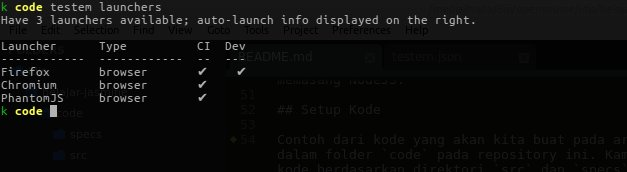

Dan pembaca dapat memilih daftar browser yang sudah dideteksi oleh **testem**, kemudian menuliskannya pada properti `launch_in_dev`.

## Eksplorasi fungsi-fungsi Jasmine

Mari kita jalankan **testem** dengan mengetikkan perintah di bawah ini pada console:

> testem

Karena kami telah menetapkan bahwa kami ingin menguji kode kami pada browser Firefox, maka **testem** secara otomatis akan menjalankan Firefox. Hasilnya adalah sebagai berikut:

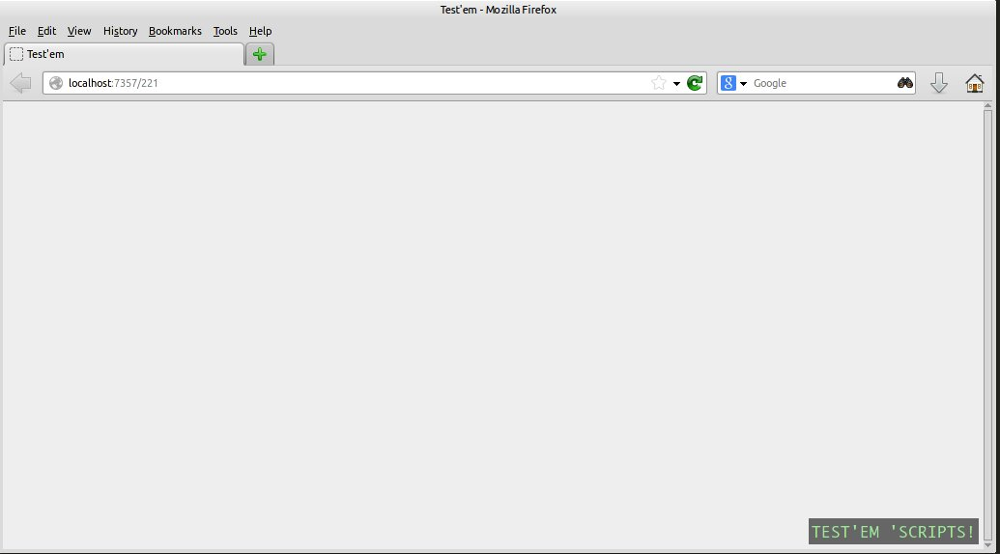

Kita belum menuliskan kode apapun. Sehingga belum ada kode yang dapat dites. Mari kita tuliskan test pertama kita. Buatlah sebuah berkas pada alamat `code/specs/vector2dSpec.js`. Pada berkas tersebut, mari kita tuliskan kode test pertama kita.

    describe("Vector2d", function(){
        it("Should have an add property", function(){
            expect(vector2d.add).toBeDefined();
        });
    });

Jadi, `describe` menunjukkan sebuah **test suite**. **Test Suite** ini semacam kelompok besar dari sebuah test. Jadi, pada contoh di atas, kita memiliki sebuah **test suite** mengenai module `Vector2d`. Kita bisa menentukan nama lain dari **test suite** tersebut. Misalnya:

    describe("Uji coba Vector2d", function(){

    });

Di dalam sebuah **test suite**, kita memiliki **specs**. Disinilah kode testing kita tuliskan. Pada contoh di atas, kita memiliki sebuah **specs**, dimana kita mengharapkan bahwa sebuah objek `vector2d` memiliki sebuah properti `add`. Bila kita menyimpan kode di atas, maka tampilan dari browser kita sudah berubah:

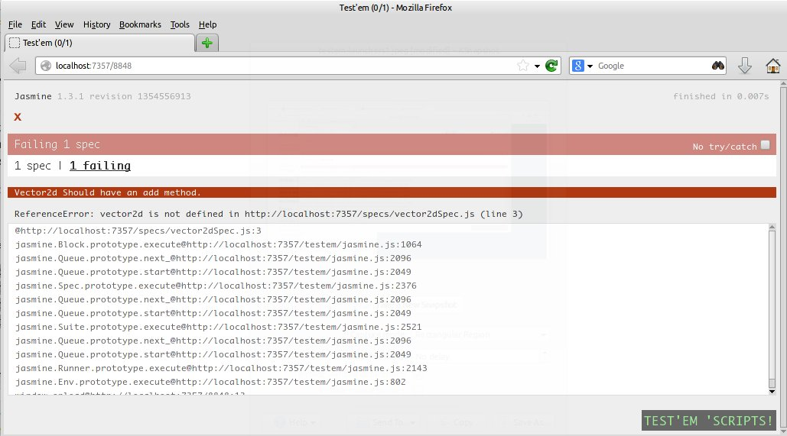

Mari kita lihat peringatannya:

    ReferenceError: vector2d is not defined in http://localhost:7357/specs/vector2dSpec.js (line 3)

Jasmine memberitahukan kepada kita bahwa objek vector2d belum terdefinisikan. Ini sudah jelas, kita belum menuliskan kode vector2d yang hendak kita test. Ayo kita tulis module tersebut. Kita simpan module vector2d pada alamat `code/src/vector2d.js`:

    (function(global){
        var vector2d = {

        };

        global.vector2d = vector2d;
    }(window));

Pada code di atas, kita memperkenalkan objek vector2d pada **global objek**. Pendekatan ini hanyalah contoh. Pada project sebenarnya, bisa jadi kita menggunakan suatu **namespace** tertentu, ataupun menggunakan mekanisme module lainnya. Tetapi pada contoh ini, tujuan utamanya adalah bagaimana agar objek `vector2d` dapat dikenali oleh kode test kita.

Ketika kita menyimpan kode di atas, maka tampilan browser akan berubah. Kita memperoleh pesan error baru:

    Expected undefined to be defined.

Mari kita bandingkan pesan error di atas dengan kode test kita:

    expect(vector2d.add).toBeDefined();

Hampir mirip bukan? Namun kode test di atas membangkitkan error karena `vector2d.add` belum terdefinisikan. Oleh jamine, `vector2d.add` bernilai `undefined`. Padahal kita menginginkan `vector2d.add` sudah terdefinisikan.

Ayo kita tambahkan properti add pada objek `vector2d`:

    (function(global){
        var vector2d = {
            add: ""
        };

        global.vector2d = vector2d;
    }(window));

Ketika kode di atas kita simpan, kita memperoleh tanda bahwa kode module `vector2d` sudah lolos uji coba:

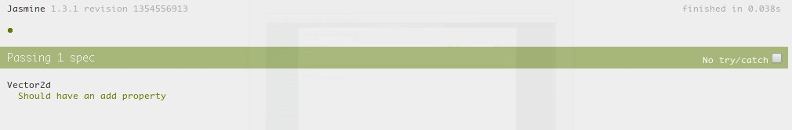

Sekarang mari kita buat kode test baru. Seiring kita membuat test, kita juga akan menambahkan kode pada module `vector2d` kita.

Misalnya kita ingin memeriksa bahwa `add` pada `vector2d` adalah sebuah `function`. Maka, kode testnya adalah sebagai berikut:

    describe("Vector2d", function(){
        it("Should have an add property", function(){
            expect(vector2d.add).toBeDefined();
        });

        it("Should have an add property which has the typeof function", function(){
            expect(typeof vector2d.add).toEqual("function");
        });
    });

Dan ketika kita simpan kode di atas, kita akan memperoleh tanda merah:

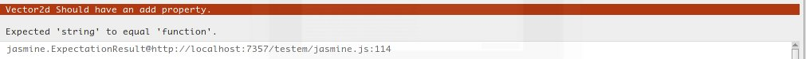

Ok, masalahnya adalah, properti `add` pada objek `vector2d` adalah sebuah string, bukan fungsi. Jadi jelaslah jasmine membangkitkan kode di atas. Mari kita perbaiki module `vector2d` kita:

    (function(global){
        var vector2d = {
            add: function(){

            }
        };

        global.vector2d = vector2d;
    }(window));

Dan ketika kita simpan, warna hijau muncul kembali. :D

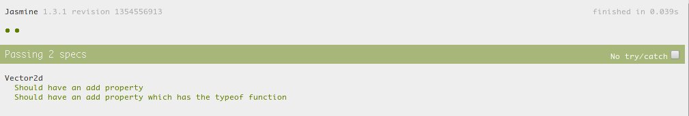

Ok, pada titik ini, kita sudah berkenalan dengan lima kata kunci pada Jasmine, yaitu `describe`, `it`, `expect`, `toBeDefined`, dan `toBe`. Jasmine masih menyediakan banyak fungsi lainnya yang bertujuan untuk memudahkan penulisan kode test kita.

Sekarang saatnya kita menguji apakah `vector2d.add()` akan mengembalikan jawaban sesaui dengan harapan kita. Bila kita menambahkan dua buah vektor, `v1` dan `v2`, dimana pada tiap vektor, terdapat properti `x` dan `y`, maka kita juga mengharapkan metode `vector2d.add()` mengembalikan jawaban berupa sebuah objek dengan properti `x` dan `y` pula.

Jadi, misal:

    var v1 = {
            x: 20,
            y: 30
        },
        v2 = {
            x: 5,
            y: 1
        };

Maka, bila kedua objek di atas dijumlahkan, seharusnya hasilnya adalah sebuah objek dengan properti `x` bernilai `25`, dan `y` bernilai `31`.

Untuk memastikan hal tersebut, mari kita buat testnya terlebih dahulu. Kita akan melakukannya secara bertahap. Pertama, kita periksa bahwa nilai yang dikembalikan oleh metode `add` memiliki properti `x` dan `y`:

    it("Add method should return an object with property x and y", function(){
        var v1 = { x: 20, y: 30},
            v2 = { x: 5, y: 1};

        expect(vector2d.add(v1, v2).hasOwnProperty("x")).toBeTruthy();
    });

Apa yang terjadi ketika kita menyimpan kode test di atas?

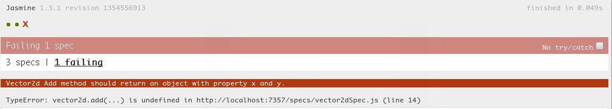

Ok, kita memang belum mengembalikan apapun ketika metode `add` dijalankan (perhatikan **TypeError: vector2d.add(...) is undefined**). Mari kita buat kode secukupnya agar kode test kita berwarna hijau:

    var vector2d = {
        add: function(){
            return {x: 0, y: 0};
        }
    };

Hasilnya? Hijau.

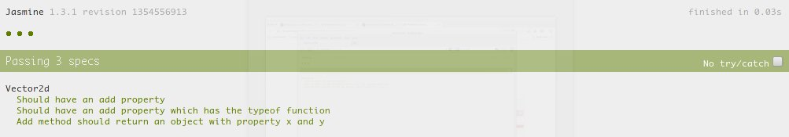

Sekarang saatnya memeriksa apakah kembalian dari metode `add` bernilai benar.

    it("Add method should return the correct answer", function(){
        var v1 = { x: 20, y: 30},
            v2 = { x: 5, y: 1};

        expect(vector2d.add(v1, v2)).toEqual({x: 25, y: 31});
    });

Namun, kode test di atas akan menghasilkan:

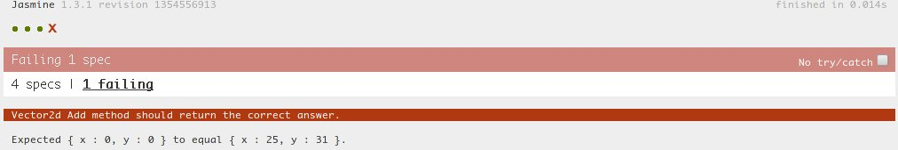

Perhatikan bagaimana jasmine memberitahukan kepada kita, kesalahan yang berhasil ditangkap oleh kode test terhadap module `vector2d`. Ketika kita mengharapkan kembalian berupa `{x: 25, y: 31}`, metode `add` malah mengembalikan `{x: 0, y: 0}`. Jelas bukan pesan errornya?

Saatnya memperbaiki metode `add`:

    var vector2d = {
        add: function(v1, v2){
            return {x: v1.x + v2.x , y: v1.y + v2.y};
        }
    };

Dan, yap, hasilnya hijau:

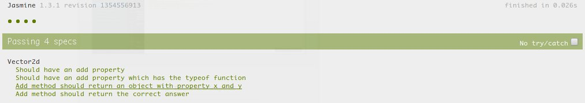

Ok, sampai disini semoga kita dapat melihat bagaiman **testem** telah memudahkan kita dalam menggunakan jasmine. Kita dapat memperoleh hasil dari testing secara langsung dan otomatis tiap kali kode kita mengalami perubahan.

Jangan lupa juga, bahwa **testem** juga melaporkan progress test kita pada console dimana command **testem** dijalankan:

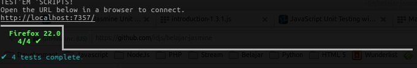

### Menstrukturkan Test Suite

Kita dapat terus melanjutkan untuk menambahkan **specs** pada test kita sebelumnya. Namun ada suatu pendekatan yang dapat memudahkan kita dalam hal penstrukturan test.

Misal, pada kode test yang sudah ada saat ini, kita mengetahui bahwa kita sedang melakukan pengujian terhadap metode `add` yang dimiliki oleh `vector2d`. Bagaimana kalau kita mengelompokkan seluruh pengujian terhadap `add` di dalam sebuah kelompok sendiri?

Caranya adalah dengan menggunakan `describe`:

    describe("Vector2d", function(){
        describe("Add method", function(){
            it("Should have an add property", function(){
                expect(vector2d.add).toBeDefined();
            });

            it("Should have an add property which has the typeof function", function(){
                expect(typeof vector2d.add).toEqual("function");
            });

            it("Add method should return an object with property x and y", function(){
                var v1 = { x: 20, y: 30},
                    v2 = { x: 5, y: 1};

                expect(vector2d.add(v1, v2).hasOwnProperty("x")).toBeTruthy();
            });

            it("Add method should return the correct answer", function(){
                var v1 = { x: 20, y: 30},
                    v2 = { x: 5, y: 1};

                expect(vector2d.add(v1, v2)).toEqual({x: 25, y: 31});
            });
        });
    });

Tampilan jasmine kita juga mengalami perubahan:

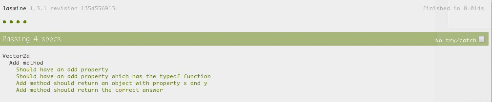

### Matchers Lainnya

Metode seperti `toEqual`, `toBeDefined`, `toBeTruthy` yang sudah kami perlihatkan di atas adalah contoh dari **matchers**. Jasmine memiliki **matchers** lainnya yang dapat digunakan untuk menguji kode yang kita tulis.

Misal, kita memiliki fungsi `substract` berikut (kelanjutan dari module `vector2d` di atas):

    // .. code sebelumnya

    substract: function(v1, v2){
        return {x: v1.x - v2.x , y: v1.y - v2.y};
    }

    // .. code berikutnya

Kita dapat memanfaatkan beberapa **matchers** lainnya untuk menguji kode di atas (*pendekatan di bawah ini belum tentu adalah pendekatan yang efektif. Ketika menguji suatu kode, kita sebaiknya tidak asal menguji kode tersebut. Namun contoh di bawah ini hanyalah contoh penggunaan matchers lainnya yang telah disediakan oleh jasmine*)

    describe("Substract method", function(){
        it("Should substract properly", function(){
            var v1 = {x: 20, y: 30},
                v2 = {x: 5, y: 50};

            expect(vector2d.substract(v1, v2)).toEqual({x: 15, y: -20});
        });

        it("Should only have x and y as direct properties", function(){
            var v1 = {x: 20, y: 30},
                v2 = {x: 5, y: 50},
                result = vector2d.substract(v1, v2);

            // memeriksa sesuatu bernilai undefined
            expect(result.a).toBeUndefined();

            // berikut ini sama saja dengan bentuk di atas
            expect(result.a).not.toBeDefined();
        });

        it("Should have no problem working with PI", function(){
            var v1 = {x: 20, y: 30},
                v2 = {x: 5, y: Math.PI}, // Math.PI = 3.14.... sekian sekian
                result = vector2d.substract(v1, v2);

            expect(result.y).toBeGreaterThan(26); // lebih besar dari 26
            expect(result.y).toBeLessThan(27); // kurang dari 27

            expect(result.y).toBeCloseTo(26.85, 1);
        });
    });

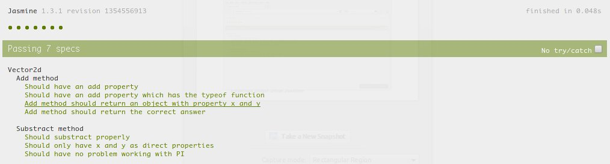

## Mata-mata

TODO

## Eksplorasi fungsi pengujian asynchronous

TODO

## Beberapa plugin untuk Jasmine

TODO

